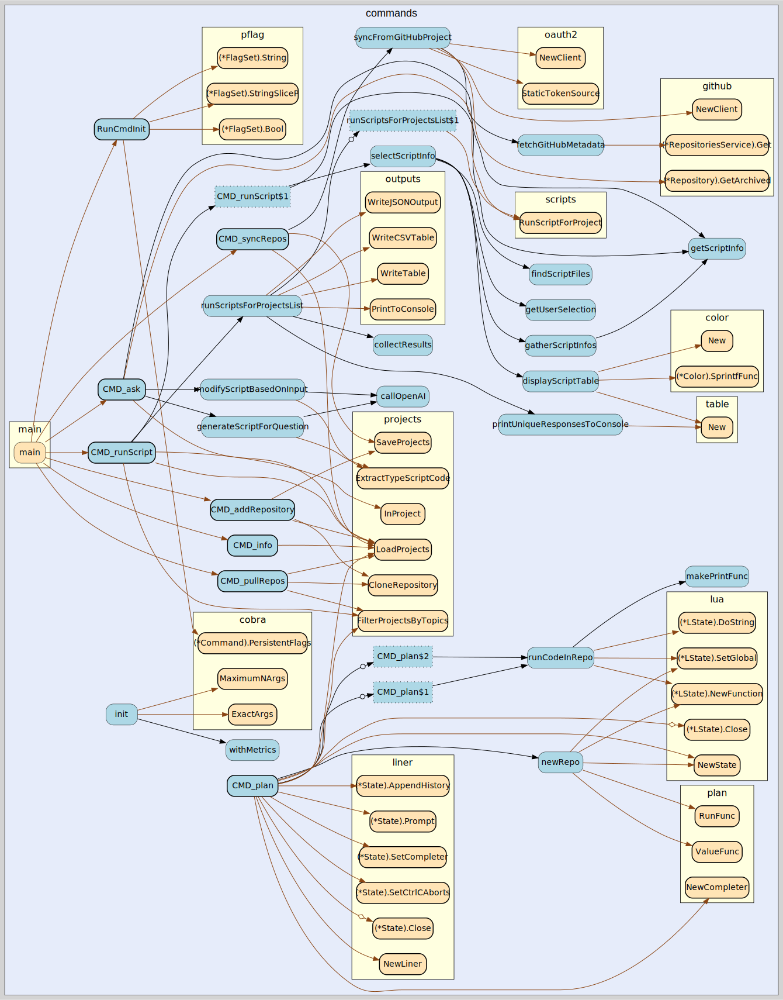
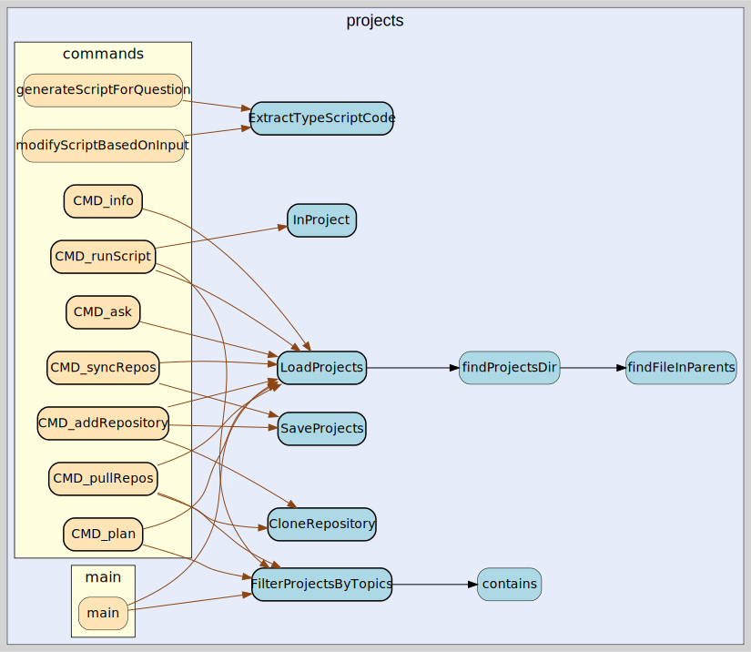

# Contributing to the Project

Thank you for considering contributing to our project! Here are some guidelines to help you get started.

## Introduction

Query Projects is a simple CLI tool designed to run scripts across multiple repositories. It helps manage repositories and execute TypeScript scripts efficiently, making it easier to automate tasks and analyze projects.

## How to Contribute

1. Fork the repository.
2. Create a new branch for your feature or bug fix.
3. Write your code and tests.
4. Ensure all tests pass.
5. Submit a pull request.

## Running Locally

1. Build the application: `go build`
2. Change cwd to the example directory: `cd example`
3. Run the compiled application: `../query-project info` (`gow build` for watching)

TODO: Document a typical watch based appoach to local development.

## Style Guide

- Use `gofmt -s -w .` to format your code.
- Write clear and concise commit messages.

## Testing

- Run `go test ./tests/... ./internal/...` to execute all tests.
- Run `go test ./tests/... ./internal/... --cover -coverprofile=coverage.out` to check coverage. View coverage using `go tool cover -html=coverage.out`.

## Visualizing

This project uses AI extensively for code generation. One means of protecting against poor quality is to evalute the code structure regularly. Run `go-callvis` to regenerate the  

```
go install github.com/ofabry/go-callvis@latest
go-callvis -nostd -format svg ./callvis
```

### Commands

The commands package contains the core functionality of the CLI. Here is a visualization of the commands package dependencies:



### Outputs

The outputs package handles formatting and displaying results from script execution. Here is a visualization of the outputs package dependencies:


### Projects

The projects package manages repository configuration and git operations. Here is a visualization of the projects package dependencies:




## Static Code Analysis (Experimental)

Check for high complexity code.

```
go install github.com/fzipp/gocyclo/cmd/gocyclo@latest
gocyclo -over 10 **/*.go
```

## Releases
Versioning is automatic using commit messages. See https://github.com/PaulHatch/semantic-version for more information.

## Communication

- Use GitHub issues for bug reports and feature requests.
- We don't currently have a slack or discord.